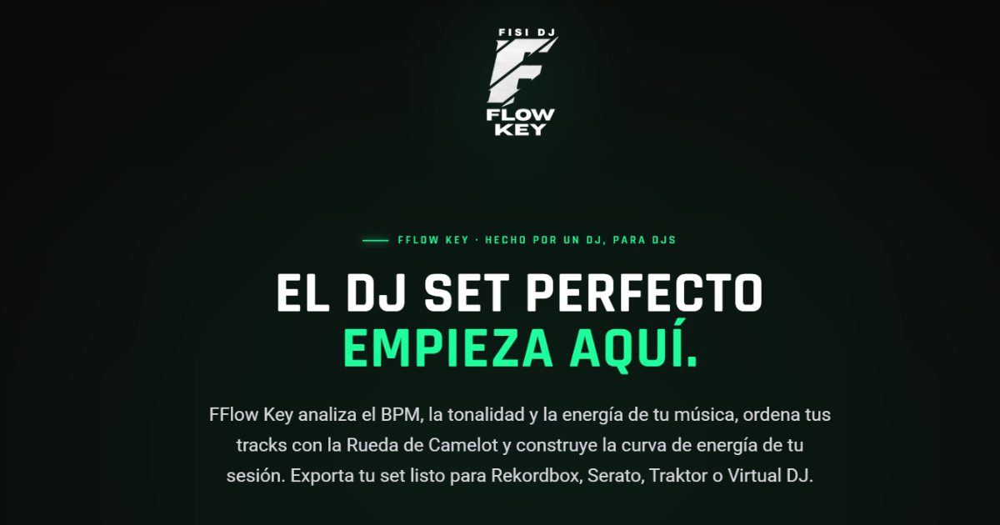
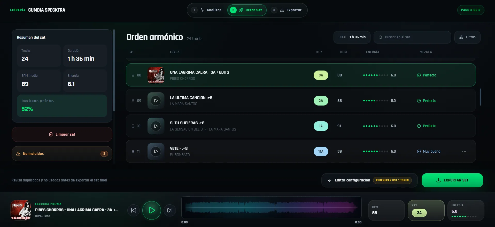
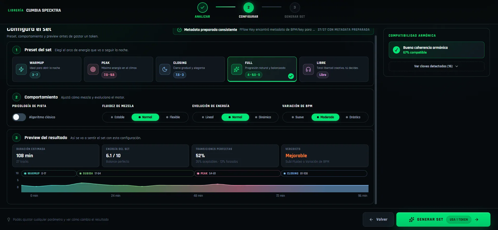
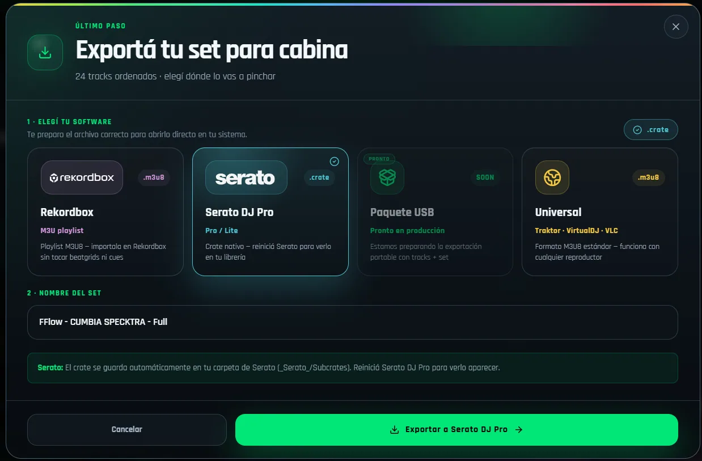

  
  <h1>FFlow Key</h1>
  
<strong>De tu biblioteca a tu próximo set.</strong>

  
Analiza tu música. Diseña el recorrido. Continúa en tu software DJ favorito.

  

    
    
    
  

  

    
    
  

  
<a href="https://fisidj.com/fflow-key/">Conoce el producto</a> · <a href="https://github.com/fisidj/fflow-key-releases/releases/latest">Novedades y archivos</a> · <a href="mailto:fisidjnetwork@gmail.com">Contacto</a>

---

**FFlow Key se integra en tu workflow de DJ.** Combina su propio motor de análisis
con los datos disponibles de tu software habitual para ayudarte a ordenar tu
música y preparar sets por BPM, tonalidad y energía. Tú eliges la música, revisas
las transiciones y decides qué llevar a cabina.

Creado por **Jorge Avendaño — FISI Dj** para resolver un problema personal:
el tiempo que llevaba organizar su música y preparar sus sesiones. Hoy se
comparte para mejorar con la experiencia y las aportaciones de otros DJs.

> **2.0.0 · beta.** La aplicación puede presentar fallos. El análisis es una
> ayuda para preparar el set: revisa los resultados y preescucha las transiciones.

## Qué puedes hacer

| Tu trabajo | Cómo te ayuda FFlow Key |
| --- | --- |
| Conocer tu música | Analiza BPM, tonalidad y energía; muestra resultados canción a canción. |
| Aprovechar lo que ya analizaste | Lee datos disponibles de Serato, Rekordbox, VirtualDJ y etiquetas de Mixed In Key. Puedes elegir las fuentes de BPM y tonalidad por separado. |
| Dar forma a la sesión | Modos Warmup, Full, Peak, Closing y Libre, con ajustes de compatibilidad armónica y evolución de energía. |
| Afinar tu selección | Preescucha, revisión de duplicados y edición del orden del set. |
| Seguir en tu software habitual | Exporta un crate para Serato o una playlist M3U8 para Rekordbox, Traktor y VirtualDJ. |
| Trabajar con más control | Validaciones de exportación y protección frente a sobrescrituras. |

## Una mirada al flujo de trabajo

  

<table>
  <tr>
    <td width="50%"></td>
    <td width="50%"></td>
  </tr>
  <tr>
    <td><strong>Diseña el recorrido.</strong> Ajusta el modo y el comportamiento del set.</td>
    <td><strong>Continúa en cabina.</strong> Elige el formato para tu software DJ.</td>
  </tr>
</table>

Imágenes de referencia del producto utilizadas en fisidj.com. La interfaz puede evolucionar durante la beta. Pulsa una imagen para verla a tamaño completo.

## De una carpeta a tu set

1. **Elige tu música.** Selecciona una carpeta y decide qué fuentes de análisis usar.
2. **Analiza gratis.** Revisa BPM, tonalidad y energía de las canciones.
3. **Configura y genera.** Elige el recorrido de tu sesión; generar un set consume un token, salvo con acceso ilimitado.
4. **Escucha, ajusta y exporta.** Continúa en tu software DJ. Exportar ese set no consume otro token.

## Descarga e instalación

| Sistema | Requisito | Instalador oficial |
| --- | --- | --- |
| **Windows x64** | Windows 10 de 64 bits o Windows 11 | [Descargar EXE](https://fflow-key-worker.fisidj.workers.dev/download/windows) |
| **Mac Intel** | macOS 10.15 Catalina o posterior | [Descargar DMG universal](https://fflow-key-worker.fisidj.workers.dev/download/macos) |
| **Apple Silicon** | macOS 11 Big Sur o posterior | [Descargar el mismo DMG universal](https://fflow-key-worker.fisidj.workers.dev/download/macos) |

- **Memoria:** 4 GB de RAM; se recomiendan 8 GB para bibliotecas grandes.
- **Pantalla:** resolución mínima de 1100 × 700.
- **Disco:** 1 GB libre para instalar, además del espacio para música y caché.
- **Internet:** para registrarse, activar la licencia y recibir actualizaciones.
- El motor de análisis viene incluido. Para usar la app no necesitas instalar Python ni herramientas de desarrollo.

**Windows:** abre el archivo `-setup.exe` y sigue el instalador. La instalación es
por usuario. Si falta WebView2 Runtime, el instalador lo descarga. El EXE no tiene
certificado de editor; Windows puede mostrar un aviso al abrirlo.

**Mac:** abre el `.dmg` y arrastra FFlow Key a **Aplicaciones**. La app no está
notarizada. Si macOS bloquea la primera apertura, sigue la opción **Abrir igualmente**
de los ajustes de seguridad descrita en la [guía oficial de Apple](https://support.apple.com/es-es/102445).

## Análisis gratis, sin suscripciones

| Opción | Qué incluye |
| --- | --- |
| **Analizar música** | Gratis e ilimitado. |
| **Cuenta nueva con Google o Microsoft** | 3 tokens de prueba, una sola vez, al crear una cuenta realmente nueva en la app. El registro manual empieza con 0 tokens. |
| **Pack 15 — €6.99** | 15 tokens. Un token por set generado, con las exportaciones de ese set incluidas. |
| **Lifetime — €49.99 de lanzamiento** | Licencia permanente para generar sets sin límite. |

[Consulta los planes y condiciones vigentes en fisidj.com](https://fisidj.com/fflow-key/#pricing).

## Actualizaciones y privacidad

La app puede consultar las nuevas versiones y verifica la firma de los paquetes
del actualizador de Tauri. Esas firmas protegen la actualización; son independientes
del certificado de editor de Windows y de la notarización de Apple.

La música se analiza localmente. La telemetría de uso requiere consentimiento;
los diagnósticos operativos se pueden gestionar desde Ajustes.

Este repositorio contiene la distribución oficial: instaladores, firmas y
manifiesto de actualización. FFlow Key es software propietario y su uso está
sujeto al acuerdo de licencia incluido en el producto.

## Tu experiencia ayuda a mejorarlo

Prueba el software con tu biblioteca y comparte qué te funciona, qué falla y qué
mejoraría tu preparación. Puedes utilizar el feedback de la app o escribir a
[fisidjnetwork@gmail.com](mailto:fisidjnetwork@gmail.com).

  
<strong>Hecho por un DJ, para DJs.</strong>

  
<a href="https://fisidj.com/fflow-key/">FFlow Key</a> · Jorge Avendaño — FISI Dj

